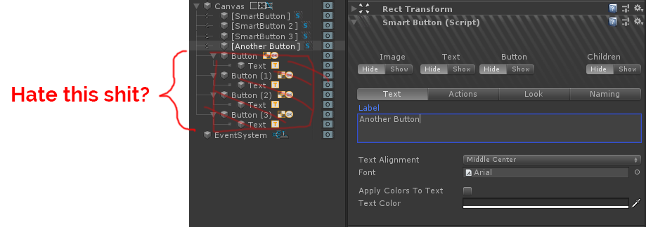
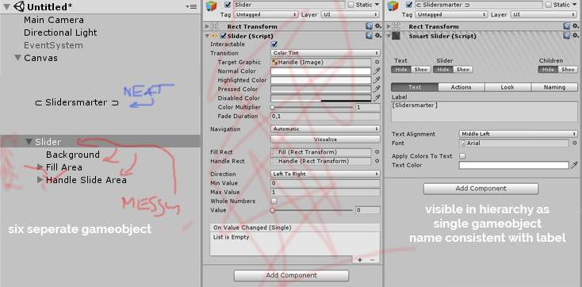

# Smart UI

it started as a workaround for some shortcomings of the Button component, but it endded up wrapping Toggles, Sliders and, to certain exted, Scrollbars as well, so its currently a collection of four scripts and their editors.

The main problem it solves can be described with an image:

I personally hate when I need to expand hierarchy to get down to text component, than rember to fold it all down, or else your hierarchy starts to become this long long expanded tree. Let's flatten the tree.

The scripts are hardly any smart, they do almost no work at all, but they clean up the editor A LOT. Access to all common parameters like text, color, callbacks, is provided via a neat editor, but it you need to there's easy access to releasing control over given component type (unhiding it).

While button was my primary grief, SmartUI works well with sliders too, compacting the ugly deafult mess of six seperate gameobject (eight if you also want to have a labal text object, and a value text object), SmartUI compacts it all into a single hierarchy item (temporarily).

The object name is also automatically kept in sync with label text which makes it easy to see which object is which. There are even some unicode bracketing optinos for fine naming experience.

Dependencies: zCore early 2019